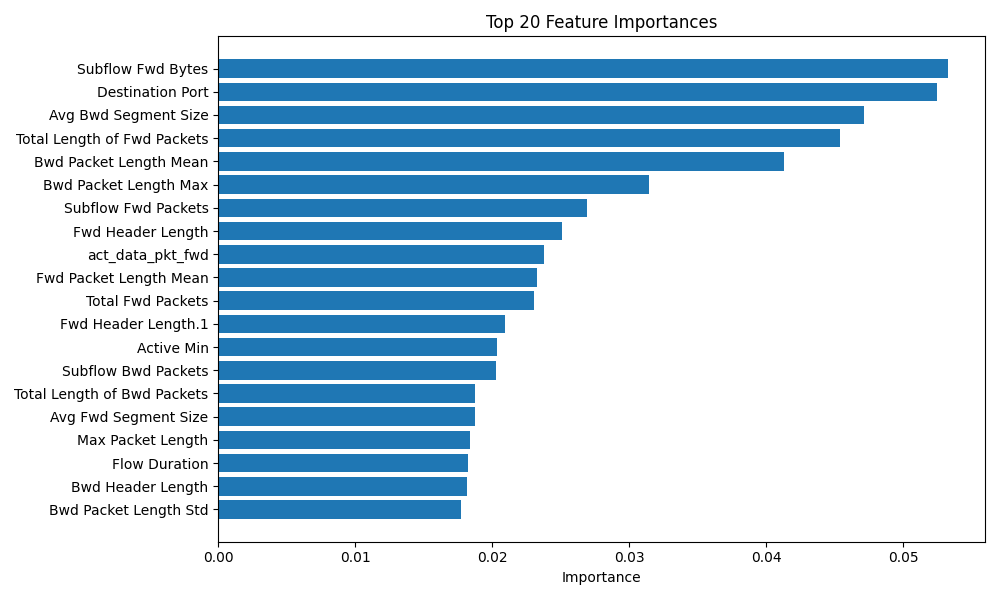

# CICIDS2017 Network Intrusion Detection with Machine Learning

This project focuses on detecting malicious network traffic using machine learning on the CICIDS2017 dataset.  
The goal is to classify traffic as **benign** or **attack** by analyzing network flow features.

## Project Overview

Intrusion Detection Systems (IDS) are critical for identifying malicious activities in computer networks.  
In this project, a binary classification approach is used to distinguish normal traffic from attack traffic.

The project includes:
- data cleaning and preprocessing
- exploratory data analysis (EDA)
- feature analysis
- model training
- evaluation with classification metrics

## Dataset

- **Dataset:** CICIDS2017
- **Task:** Binary classification (`BENIGN` vs `ATTACK`)
- **Source:** Canadian Institute for Cybersecurity

> Note: The original dataset contains multiple attack types. In this project, attack labels are merged into a single `attack` class for binary classification.

## Project Structure

```bash
data/
  raw/
  processed/
notebooks/
  01_data_cleaning.ipynb
  02_eda.ipynb
  03_feature_analysis.ipynb
  04_evaluation.ipynb
src/
  train.py
  predict.py
models/
reports/
tests/
README.md
requirements.txt

## Model Performance

### Model Comparison

| Model | Accuracy | Precision | Recall | F1-score | ROC-AUC |
|------|----------|-----------|--------|----------|---------|
| Logistic Regression | 0.97 | 0.006 | 1.00 | 0.013 | 0.999 |
| Random Forest | 0.9999 | 1.00 | 0.71 | 0.83 | 1.00 |

Random Forest model significantly outperforms Logistic Regression in terms of balanced performance.

---

## 📈 Visualization

### Confusion Matrix (Random Forest)


### ROC Curve


### Precision-Recall Curve


### Feature Importance
