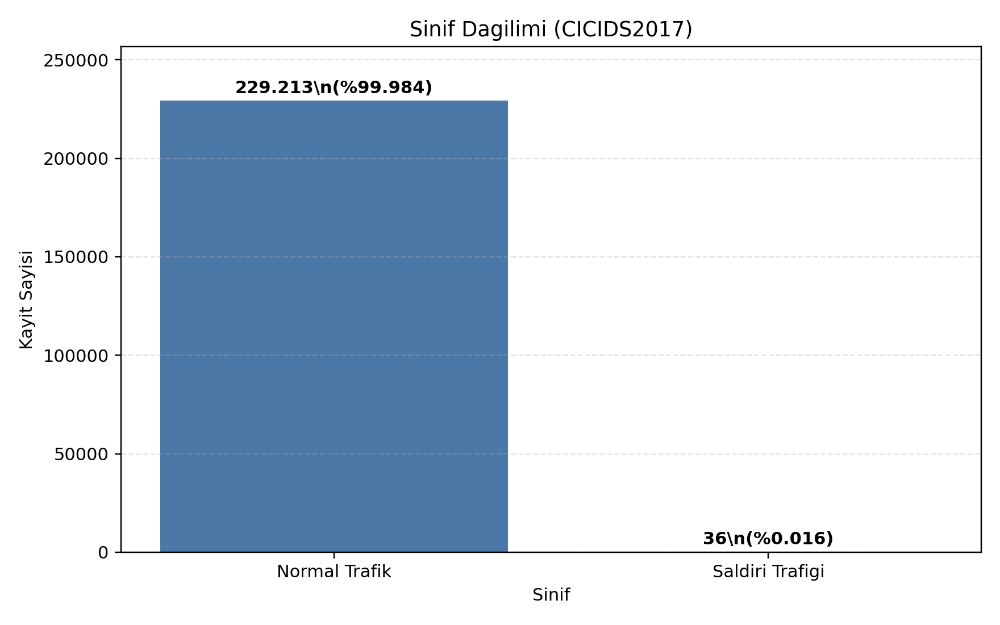
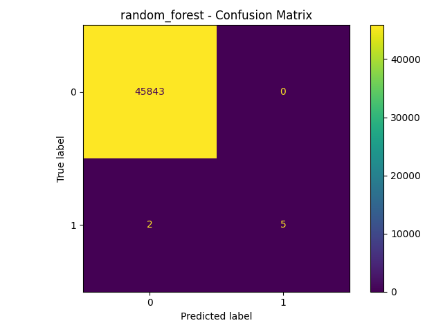
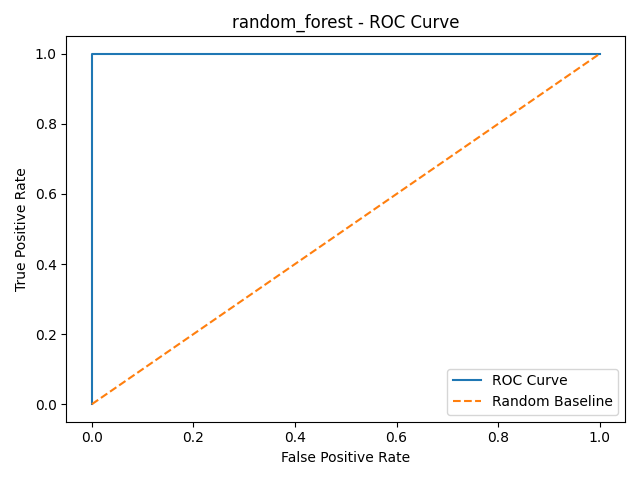
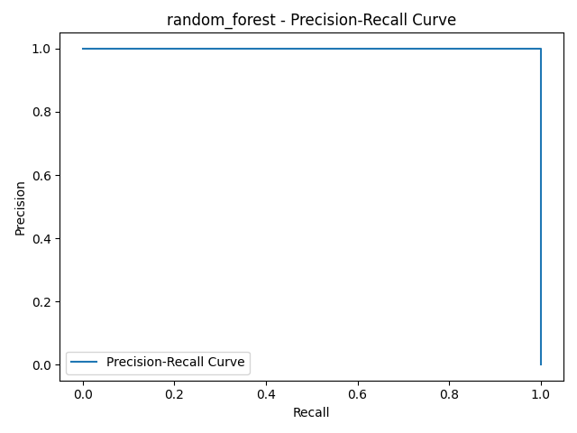
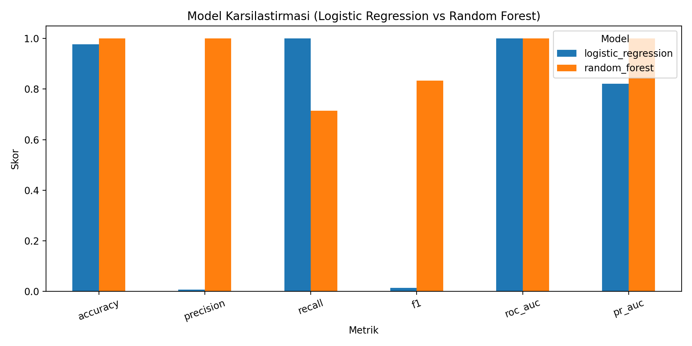

# CICIDS2017 Network Intrusion Detection with Machine Learning

This project focuses on detecting malicious network traffic using machine learning on the CICIDS2017 dataset.  
The goal is to classify traffic as **benign** or **attack** by analyzing network flow features.

## Project Overview

Intrusion Detection Systems (IDS) are critical for identifying malicious activities in computer networks.  
In this project, a binary classification approach is used to distinguish normal traffic from attack traffic.

The project includes:

- data cleaning and preprocessing
- exploratory data analysis (EDA)
- feature analysis
- model training
- evaluation with classification metrics

## Dataset

- **Dataset:** CICIDS2017
- **Task:** Binary classification (`BENIGN` vs `ATTACK`)
- **Source:** [Canadian Institute for Cybersecurity — CICIDS2017](https://www.unb.ca/cic/datasets/ids-2017.html)

> Note: The original dataset contains multiple attack types. In this project, attack labels are merged into a single `attack` class for binary classification.

Raw CSV files are not stored in this repository (see `.gitignore`). Download the dataset from the link above and place the day CSV files under `data/raw/` before running the notebooks.

## Quick start

1. **Environment**

   ```bash
   python -m venv .venv
   source .venv/bin/activate   # Windows: .venv\Scripts\activate
   pip install -r requirements.txt
   ```

2. **Prepare data** — Add CICIDS2017 CSV exports under `data/raw/`, then open and run [`notebooks/01_eda.ipynb`](notebooks/01_eda.ipynb) from the repo root. It loads the raw files, performs cleaning/EDA, and writes the processed file expected by training:

   `data/processed/cicids2017_clean.csv`

3. **Train models** (from repository root):

   ```bash
   python src/train.py
   ```

   This reads `data/processed/cicids2017_clean.csv`, saves metrics and plots under `reports/`, and writes the best model bundle under `models/`.

4. **Predict on new rows** (CSV columns must match the training feature set):

   ```bash
   python src/predict.py --input path/to/your.csv --output reports/predictions.csv
   ```

   Use `--model models/<name>.joblib` to pick a specific saved model instead of the latest file in `models/`.

## Project Structure

```text
data/
  raw/           # CICIDS2017 CSVs (not in git)
  processed/     # cicids2017_clean.csv produced by 01_eda.ipynb
notebooks/
  01_eda.ipynb              # cleaning, EDA, writes processed CSV
  02_modeling.ipynb
  03_feature_analysis.ipynb
  04_evaluation.ipynb
src/
  train.py
  predict.py
models/          # trained .joblib bundles (ignored by git by default)
reports/         # metrics, plots, predictions
  figures/       # thesis-style figure assets (stable filenames)
tests/
requirements.txt
README.md
```

## Model performance

CICIDS2017 is **highly class-imbalanced** (many benign flows, far fewer attacks). For such data, **accuracy and ROC-AUC can look strong even when precision on the minority class is poor**. Logistic Regression was evaluated with a default 0.5 decision threshold in the reported run; it catches most attacks (high recall) but flags very few of them with high precision, which shows up as very low precision and F1 below. Random Forest achieves a more balanced trade-off for this pipeline.

### Model comparison

| Model | Accuracy | Precision | Recall | F1-score | ROC-AUC |
|-------|----------|-----------|--------|----------|---------|
| Logistic Regression | 0.97 | 0.006 | 1.00 | 0.013 | 0.999 |
| Random Forest | 0.9999 | 1.00 | 0.71 | 0.83 | 1.00 |

Random Forest is the stronger choice here when balancing precision and recall on the attack class.

## Visualizations

Figures below use stable paths under [`reports/figures/`](reports/figures/). Additional plots from training runs (timestamped filenames) may appear directly under `reports/`.

### Class distribution (imbalance)



### Confusion matrix (Random Forest)



### ROC curve (Random Forest)



### Precision–recall curve (Random Forest)



### Model metrics comparison



### Feature importance (Random Forest)


Caption and citation snippets for all thesis figures are listed in [`reports/figures/sekil_listesi_ve_atiflar.md`](reports/figures/sekil_listesi_ve_atiflar.md).
